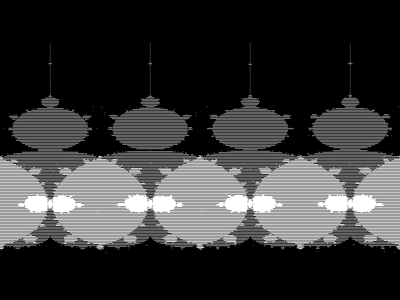

# Fractal Viewer

Generates the Mandelbrot fractal and shows it, allowing to zoom in, zoom out and move around using a GUI. To use it simply run the `run.sh` shell file.

Here's the kind of images it can generate:

</img>

The focus was simplicity, not performance. I wrote the GUI and most of the code in Python, to make it as small and clear as possible. There's a C++ file that crunches the numbers, which is invoked by the Python script when generating new images. The C++ script outputs the result into a file, which is read by the Python script. This made the code very small and simple.
