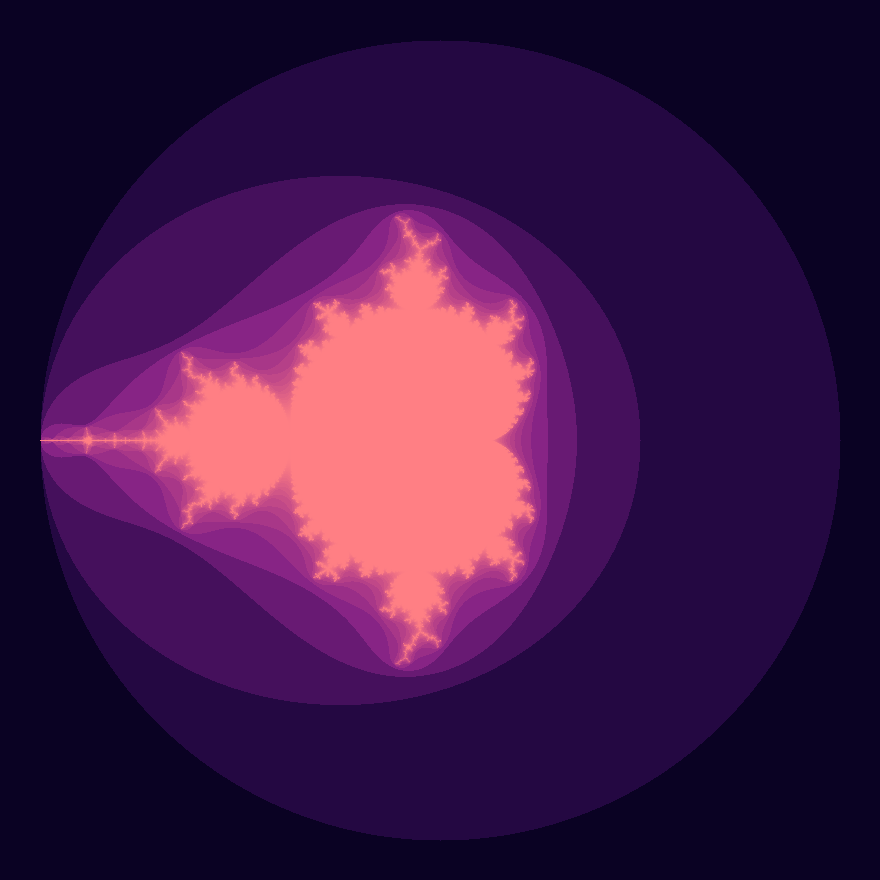

# Fractal Viewer

Generates the Mandelbrot fractal and shows it, allowing to zoom in, zoom out and move around using a GUI. To use it simply run the `run.sh` shell file.

Here's the kind of images it can generate:

</img>

